# Self Attacks

## Attack 1

| Item           | Result                                                                   |
| -------------- | ------------------------------------------------------------------------ |
| Date           | Apr 11, 2026                                                             |
| Classification | Authentication Failures                                                  |
| Severity       | 4                                                                        |
| Description    | Unchanged default credentials were used to access admin account          |
| Images         | 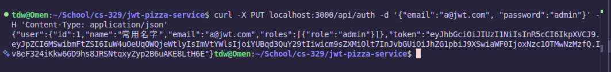 |
| Corrections    | Update default passwords                                                 |

## Attack 2

| Item           | Result                                                                                                                                 |
| -------------- | -------------------------------------------------------------------------------------------------------------------------------------- |
| Date           | Apr 11, 2026                                                                                                                           |
| Classification | Injection                                                                                                                              |
| Severity       | 4                                                                                                                                      |
| Description    | SQL injection successfully overwrote all emails in the database, making all accounts unusable. Could be used to execute arbitrary SQL. |
| Images         | 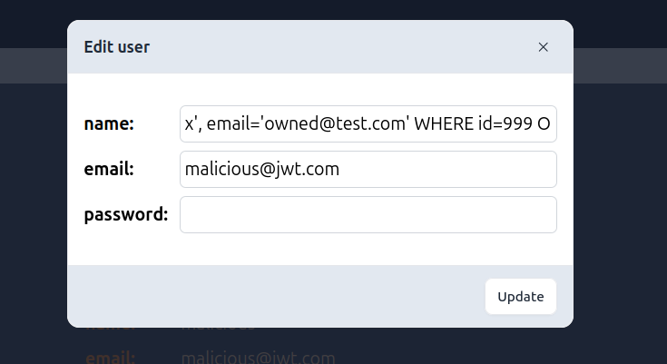 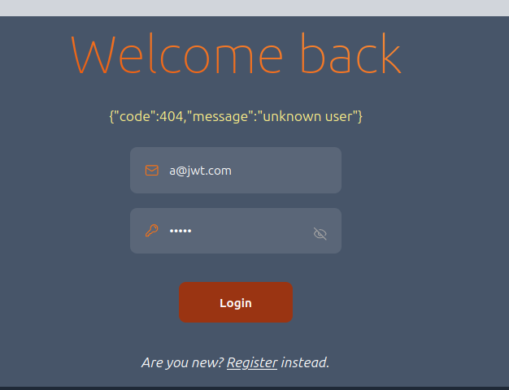                           |
| Corrections    | Sanitize inputs when handling the `PUT /api/user/:userId` endpoint.                                                                    |

## Attack 3

| Item           | Result                                                                                                   |
| -------------- | -------------------------------------------------------------------------------------------------------- |
| Date           | Apr 11, 2026                                                                                             |
| Classification | Security Misconfiguration                                                                                |
| Severity       | 3                                                                                                        |
| Description    | API error responses exposed internal stack traces, revealing file paths and server internals.            |
| Images         | 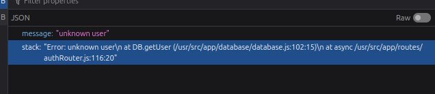                                         |
| Corrections    | Update global error handler to return sanitized errors in production and hide stack traces from clients. |

## Attack 4

| Item           | Result                                                                                                                                                           |
| -------------- | ---------------------------------------------------------------------------------------------------------------------------------------------------------------- |
| Date           | Apr 11, 2026                                                                                                                                                     |
| Classification | Security Misconfiguration                                                                                                                                        |
| Severity       | 3                                                                                                                                                                |
| Description    | The endpoint at 'GET /api/user' does not properly filter down users by role, only by authentication token. Retrieved a list of all users using basic login token |
| Images         | 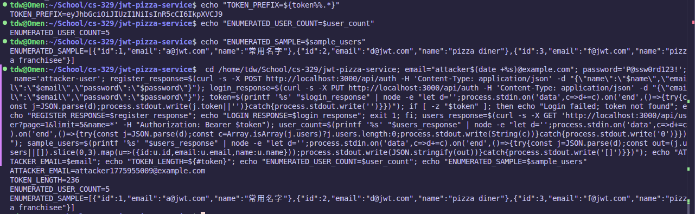                                                                                                        |
| Corrections    | Add an explicit admin authorization check to the endpoint, returning 403 without proper permissions                                                              |

## Attack 5

| Item           | Result                                                                                                                                                                                                                                                       |
| -------------- | ------------------------------------------------------------------------------------------------------------------------------------------------------------------------------------------------------------------------------------------------------------ |
| Date           | Apr 11, 2026                                                                                                                                                                                                                                                 |
| Classification | Injection                                                                                                                                                                                                                                                    |
| Severity       | 3                                                                                                                                                                                                                                                            |
| Description    | A scripted set of SQL manipulation attempts against `GET /api/franchise` and `GET /api/user` showed malformed pagination payloads could trigger database syntax failures and internal error output. Union payloads did not return injected rows in this run. |
| Images         | 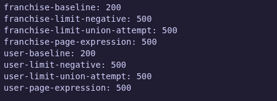                                                                                                                                                                                 |
| Corrections    | Sanitize and clamp `page`/`limit` values to integers, parameterize LIMIT/OFFSET in SQL queries, and add regression tests for malformed payloads.                                                                                                             |

# Peer Attacks

## Attack 1

| Item           | Result                                                     |
| -------------- | ---------------------------------------------------------- |
| Date           | Apr 13, 2026                                               |
| Classification | Authentication Failures                                    |
| Severity       | 4                                                          |
| Description    | Admin default credentials were left unchanged              |
| Images         | 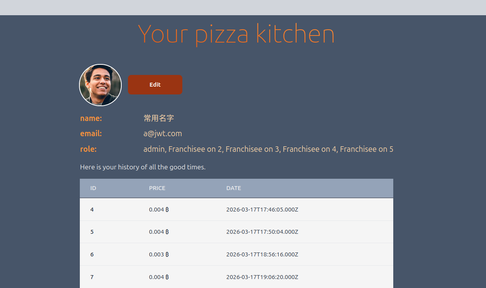 |

## Attack 2

| Item           | Result                                                                                                                                                  |
| -------------- | ------------------------------------------------------------------------------------------------------------------------------------------------------- |
| Date           | Apr 13, 2026                                                                                                                                            |
| Classification | Security Misconfiguration                                                                                                                               |
| Severity       | 3                                                                                                                                                       |
| Description    | The endpoint at 'DELETE /api/franchise/:franchiseId' does not properly filter down users by role, only by authentication token. Deleted all franchises. |
| Images         | 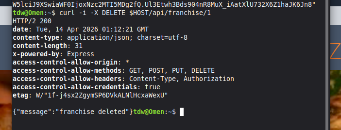                          |

## Attack 3

| -------------- | ---------------------------------------------------------------------------------------------------------------------------------------------------------------- |
| Date | Apr 13, 2026 |
| Classification | Security Misconfiguration |
| Severity | 3 |
| Description | The endpoint at 'GET /api/user' does not properly filter down users by role, only by authentication token. Retrieved a list of all users, including password hashes and emails, using basic login token |
| Images | 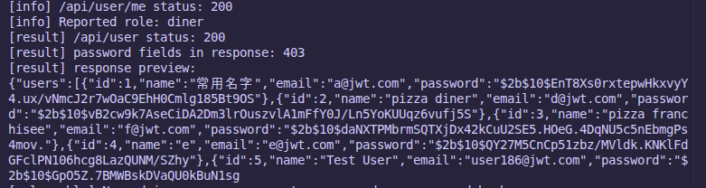 |

## Attack 4

| Item           | Result                                                                                        |
| -------------- | --------------------------------------------------------------------------------------------- |
| Date           | Apr 13, 2026                                                                                  |
| Classification | Security Misconfiguration                                                                     |
| Severity       | 3                                                                                             |
| Description    | API error responses exposed internal stack traces, revealing file paths and server internals. |
| Images         | 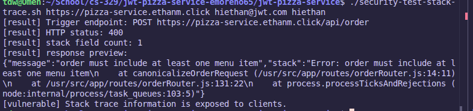                                  |

## Attack 5

| Item           | Result                                                                                     |
| -------------- | ------------------------------------------------------------------------------------------ |
| Date           | Apr 13, 2026                                                                               |
| Classification | SQL Injection                                                                              |
| Severity       | 5                                                                                          |
| Description    | SQL injection overwrote all emails in database. Capable of executing arbitrary SQL queries |
| Images         | 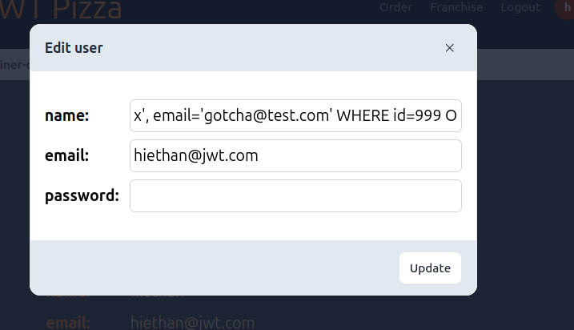 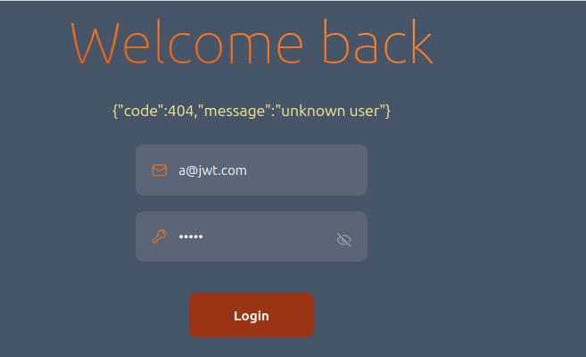  |
