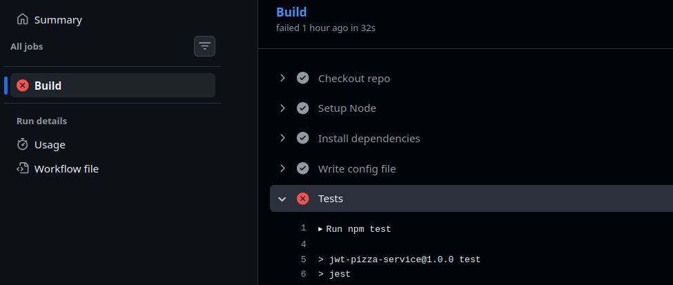

# Curiosity Report: Local Github Actions

## Why I Was Curious About Local Actions

As we implemented more functionality into our CI pipeline during deliverable #3, I found myself frustrated with the associated debugging process. When a deployment worked locally but failed remotely, I'd have to open up Github, navigate to the proper section in Actions, decide where the deployment broke, add logging statements, re-deploy, wait for Actions to build a new environment, watch it break again, realize I needed logging statements elsewhere, etc. until finally fixing the issue. I figured there must be tools that enabled a much quicker and easier workflow than the ones I was using.



My initial idea was to bundle up my whole project in a reproducible docker container. While this is certainly best practice long-term, I received feedback that it wasn't very realistic at such early stages of such a small project. I then discovered 'Act' by Nektos, a solution for running Github actions locally.

## Exploring Act

After having trouble installing Act's CLI agent, I found out that the service is offered through a VS Code extension. From what I understand, Act looks your repository’s .github/workflows directory to detect valid workflow files and allows you to run them locally inside Docker containers. These containers closely mirror GitHub’s remote environments for the sake of reproducibility. When a workflow is triggered, Act spins containers for each job, mounts your local repository into the container, starts a simulated GitHub event, and executes each step exactly as GitHub Actions would.


## Setup

1. Install Docker: Act requires Docker to be installed and running on your machine, make sure the Docker engine is working

2. VS Code Extension: In VS Code, search for "GitHub Local Actions" by Nektos in the Extensions marketplace and install it.

3. Set Up Secrets: If your workflows use secrets (like JWT Pizza), I've found the easiest way is to edit the 'Secrets' setting directly in the bottom left-hand corner of the extension's tab. The extension will automatically use this file to populate secrets during local runs. Repository secrets are NOT pulled in directly from Gitub, though their names are.

4. Run A Workflow: Click on workflow in the Local Actions panel (the ones defined with `.yml` files), select the job you want to run, and click the play button. The extension will pull the necessary Docker images (this may take a few minutes the first time) and execute your workflow locally.

5. Try Different Events: The extension supports easy simulation of different Github events like `push` and `workflow_dispatch` (like the ones used in JWT Pizza). This makes it easy to test events that can otherwise be difficult to reproduce.

## Handling Lack of GitHub Backend

Act runs workflows inside Docker containers, but it cannot replicate GitHub’s backend services. Steps that depend on GitHub infrastructure (deployment to Github Pages, for example) will not function correctly during local runs.

Act sets an `ACT=true` environment variable during local runs. Use it to conditionally skip backend-dependent steps:

```yaml
jobs:
    hello:
        runs-on: ubuntu-latest
        steps:
            - name: Hello World
                run: echo "Hello World"
            - name: Checking if actions are local
                if: ${{ env.ACT }}
                run: echo "This is a local run"
            - name: Checking if actions are running in GitHub
                if: ${{ !env.ACT }}
                run: echo "This is a GitHub run"
                run: echo "You could deploy to Github Pages here"
```

## Setup Notes

- You may experience conflicts if running MySQL locally because Docker tries to expose MySQL on port 3306. You can temporarily pause your local MySQL service or use a different port.
- [Example video](./images/act-demonstration.mp4) demonstrating installing and using Local Github Actions to speed up a debugging process

## Credits

- [Nektos on Github](https://github.com/nektos)
- [Act's repository on Github](https://github.com/nektos/act)
- [Act docs](https://sanjulaganepola.github.io/github-local-actions-docs/)
